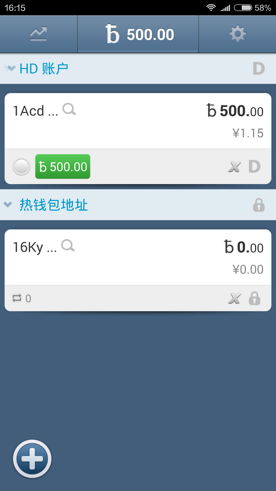
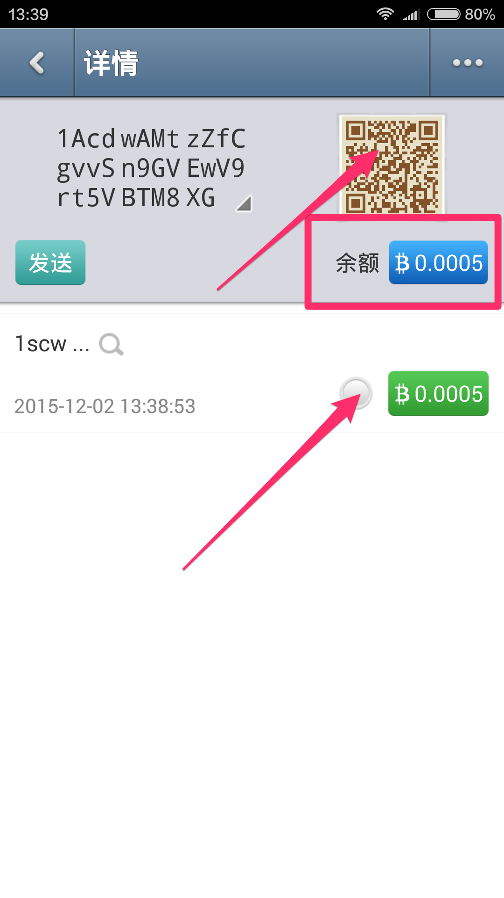
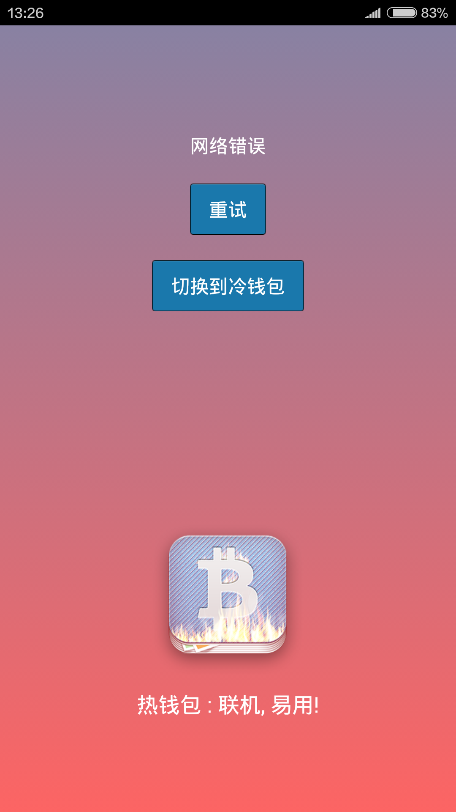

# [bither](https://bither.net)

### Use bither to manage Bitcoin

#### How to use bither?

* It's so important to some users to want to use bither.how to use bither? It is easy to use bither.Once you have the proper use, you will be able to properly take good care of our bitcoin. So then please follow me  to learn how to use bither.

##### 1. Hot wallet:

*Connected to the network*:

Directly into the interface,The background image so cute! (*^__^*)

Click on the OK button, then click the add sign in the bottom left corner you can create your HD account and the private key.

*Tips:* To keep in mind your HD account Passphrase and HD account seed QR-Code and recommend using Xrandom create an HD account (Checkmark to be selected), to ensure maximum safety of Bitcoin. As shown below:

When you uninstall bither or need to rediscover HD account, you just need to import the private options in the way in advanced options to restore or retrieve your HD account.

Creating successful HD accounts saved in your phone inside, save HD seed, he can be used to restore the HD account, maybe a lot of people do not understand what is HD account, you can also understand it as the private key of the cluster.

*Generate a private key*: use a variety of phones sensing device, "X-Random" to help you get the "true" random number. Mix of public and private key so that the FBI and the quantum computer to get your bitcoins no way (up to 50).

okay ~ understand these let us look bither interface arrangement and functional use of it.

The first button: bither menu provided to the user market is very professional and accurate, we can see that the price of Bitcoin different trading platforms as well as changes in market trend here.

The second button: Store is your HD account address, and hot wallet address, click again to see a list of your assets distributed.

Well, you now have HD account and hot wallet address, as shown below, so we all know the importance of the private key, the private key for us at bither management.

Click on a hot wallet address ~

You will see this interface ~

*Private Key Management*：

Click the distribution list of assets the second button again:

*address Tag*：

you can create your favorite address tag.

*sign Message*：You need to be verified signatures

*vanity Address Length*：

I use four vanity Address Length, my address becomes as shown in the figure below, others can be seen, more eye-catching ~

The Third button：There are some useful little future，Default unit、 Default Currency、Default Exchange、Default Transaction Fee、set Avatar As so on....

You can try a lot and you will use bither easily.  

##### 2.trade:

For bither we also understand a basic structure and function list, then how do we trade it?

*Others pay me Bitcoin:*

Others can scan my QR-Code or enter the address sequence number to me Bitcoin transactions.

* Tips: You can whether the transaction has been confirmed by an indicator next to the transaction amount learned.

*I pay to others bitcoin:*

The same principle I can trade my Bitcoins to others.

##### 3.Cold wallet

Cold wallet can store large amounts of offline bitcoin  wrapped in a phone (must be off the network), the private key is used to cold storage and off-line transaction signature, hot wallet on a networked mobile phone for sending and receiving transactions, cold wallet signature information is passed through the QR Code, convenient, and safe.

How do we installed bither and connected to the network switch to cold wallet ?

##### Tips：

1. You can switch to cold wallet when you are not generated a private key, if you generate a private key is not to switch to cold wallet.
2. When your phone is switched to the cooling wallet is not switched back to hot purse (so we can find an offline backup of smart phones, as your wallet cold, so Bitcoin offline stored in your wallet is very  safe).

Bither installed and in the case of off network run bither we will see this interface.

like hot wallet，Cold wallet can generate HD account and private key, hot wallet can monitor Bither cold , in other word, I can trade bitcoins in the cold wallet through the hot wallet, but requires cold wallet signature verification, and hot wallet get cold wallet after license allows, you can deal cold Bitcoin wallet.

##### Part of the cold wallet interface

*1.Check Private Keys*:

*2.cold HD account and Generated private keys*:

Cold wallet is also need to create HD account and private keys, operation method like hot wallet, the private key is used to decrypt and the most important resources for transaction signatures.

The interface does not create a private key; (only cold HD account)

The interface With cold HD account and private key (the private key can add up to 150);

*3.Settings*:

Advanced Options stuff inside is not difficult to understand, we can try to use.

bither hope to become serve all Bitcoin enthusiasts a safe and reliable product, we will continue to progress, thank you for your support

Here is our Sina microblogging, hope a lot of attention.

* [@比太钱包] (<http://weibo.com/bither>) and twitter[@bithernet](https://twitter.com/bithernet)

* Join us bither official QQ group: 219098359 in the group have our enthusiastic developers waiting for you to join!

