# [比太钱包](https://bither.net)

### 关于比特币

#### 比特币本身并无安全问题

比特币历史上的丢币事件想必对于比特币爱好者而言了解的十分清楚，然而这与比特币本身的安全无关，均属于互联网服务器安全的范畴，这与历史上多个网站被黑并无差别，只是因为比特币等密码学货币的盗取价值更大，让人们觉得不同而已。

其实关于互联网服务器并不存在绝对的安全，任何程序都有可能有漏洞，是漏洞就有可能被利用,比特币企业与普通的互联网公司不同，因其所保管的数字资产可能会非常巨大，别的网站遇到黑客事件往往只会丢失一些用户数据，而比特币企业遇到此类事件，则丢失的就是真金白银，这对于比特币创业者来说，显然是致命的。

#### 个人与企业应该如何防范比特币丢失

比特币匿名的特点，让人们津津乐道，同时也让黑客们有了可乘之机，丢失的比特币很难找回。

###### 对于个人比特币爱好者而言:

小额比特币（零钱）可以考虑存放在联网的设备上。大额比特币一定要存放在绝对断网的设备上，即通常所说的冷存储（不妨考虑比太冷钱包）。同时，应做好合理的备份，防止极端情况下灾难的发生。

###### 对于企业而言:

彻底解决安全问题有两点：1、对私钥要绝对的“冷”存储，不要暴漏在任何与网络连接的设备上；2、加强内部管理，我们可以说，只要随机数是可靠的，冷钱包对于黑客威胁来说，应该是绝对安全的，毕竟物理上隔绝了黑客入侵的可能。”

####合理使用你的比特币
由于比特币年轻的经济结构，新颖的特性，以及偶尔的市场流动性不足，比特币的价格可能在短时间内无规律地大起大落。所以，目前不建议用比特币来保存你的积蓄。比特币应该被视为高风险资产，千万不要将你无法承担损失的资金以比特币的形式保存。如果你收到比特币付款，有很多服务供应商可以将比特币兑换为当地货币。

和在现实生活中一样，你必须保护好自己的钱包。使用比特币可以轻而易举地在世界范围内转移资金，也让你完全掌控自己的资金。这样强大的功能也带来了很大的安全顾虑。同时，只要正确使用，比特币可以提供高级别的安全性。请随时牢记，你有责任采取良好的做法来保护自己的财产。

###比太钱包的比特币管理
####比太钱包的使用：
对很多刚接触比特币以及想使用小太的用户朋友们而言，小太的使用方法无疑是最关键的问题，小太的使用其实并不复杂，只要掌握正确的使用方式，就能妥善的保管好我们的比特币。那么接下来请跟我一起学习如何使用小太来玩转移比特币~

#####一 热钱包：
功能预览安装成功后，在有网络和断网的情况下会有不同的界面，冰火两重天的酸爽哦~

*在有网络的情况下：*
会直接进入这个界面，背景图片是不是感觉有点萌萌哒!（(*^__^*) 嘻嘻……）

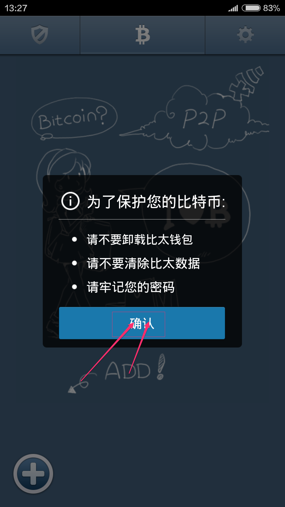

点击确认按钮后，看到这个萌萌哒小加号了没有，点击它就可以创建你的HD账户和私钥了。。
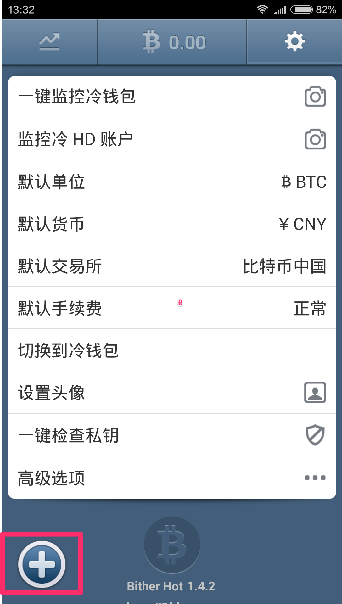

*温馨提示*：要牢牢记住你的HD账户密码哦~ 而且建议使用Xrandom创建HD账户(对勾要选中)，最大限度的保证比特币安全。如下图所示：

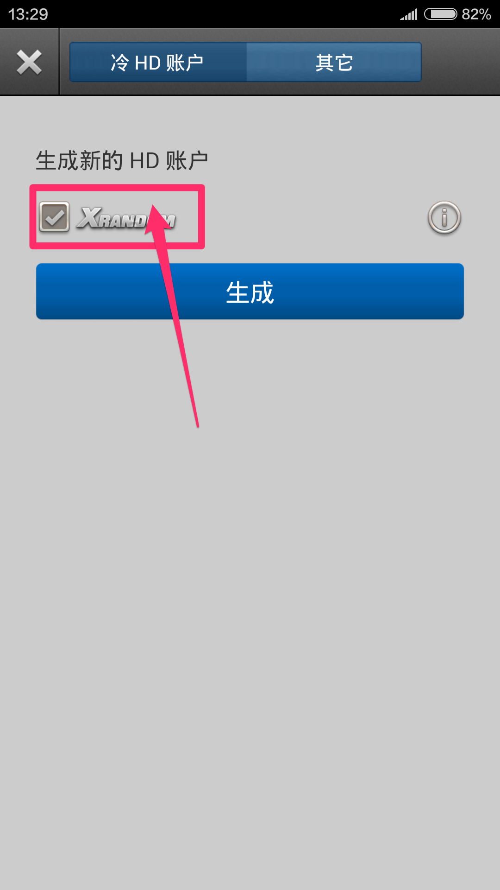

创建成功的HD账户保存在你的手机里面了，保存好HD种子，他可以用来恢复HD账户的，也许很多人不明白什么是HD账户，你也可以把它理解为私钥的集群。

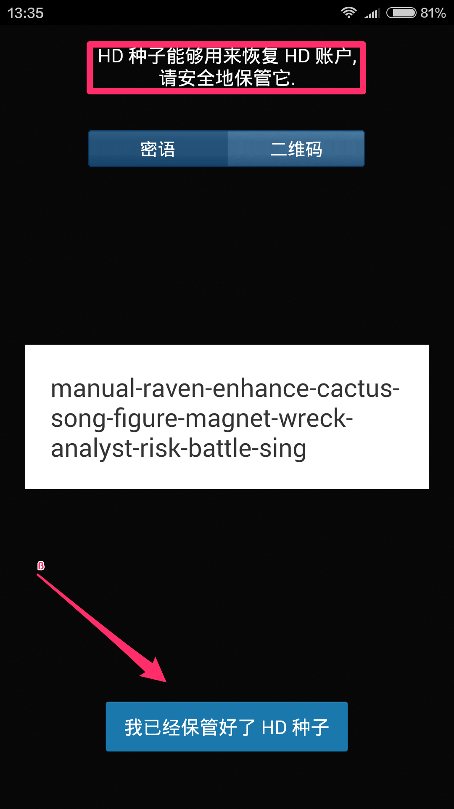

生成私钥：利用智能手机的多种感应设备，比太首创的“极随机“，帮你获取”真“随机数。公私钥的搭配让FBI和量子计算机拿你的比特币都没办法。

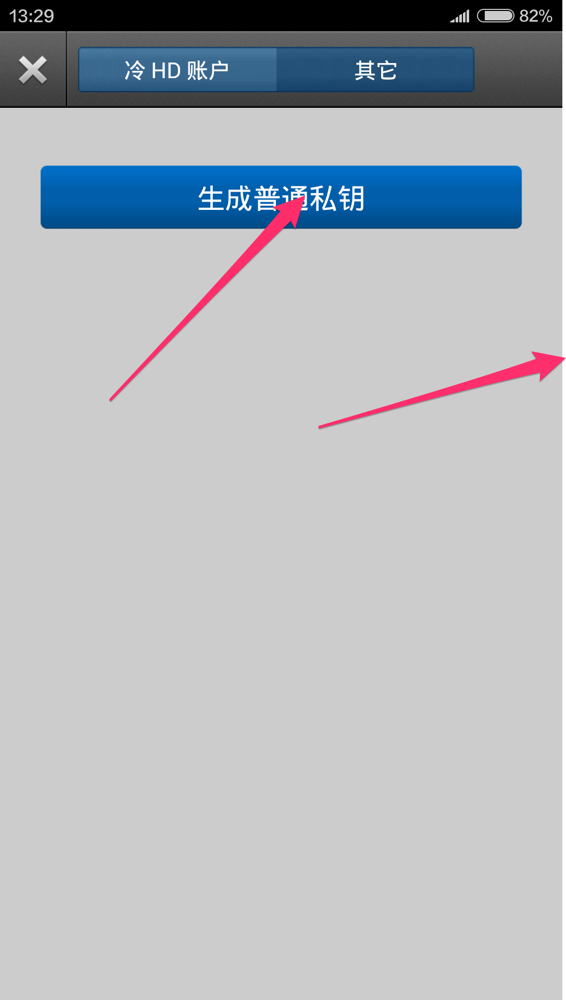

第一个按钮：小太提供给用户的行情菜单十分专业准确，大家可以在这里看到不同的交易平台的比特币价格改变~

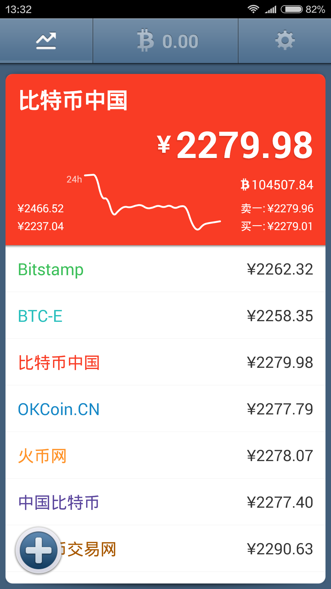

第二个按钮：存放的就是你的HD账户地址，以及热钱包地址，再次点击可以看到你的资产分布列表。

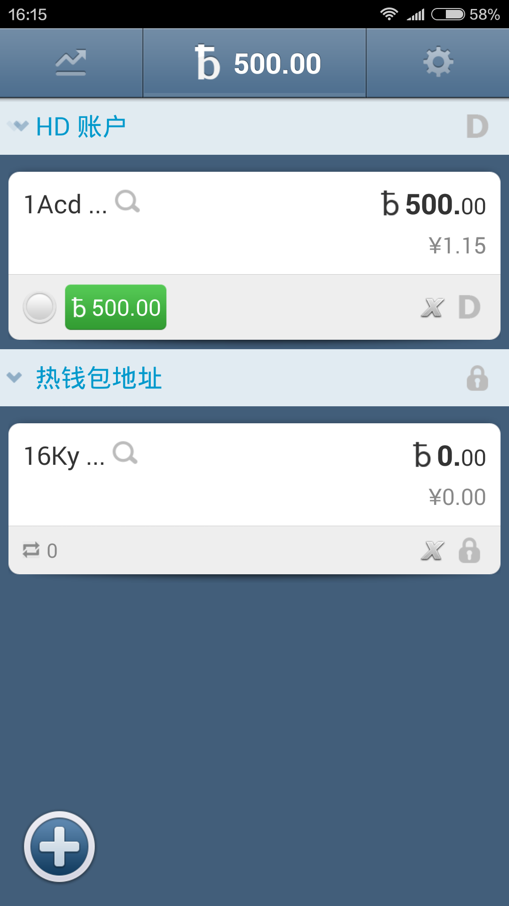

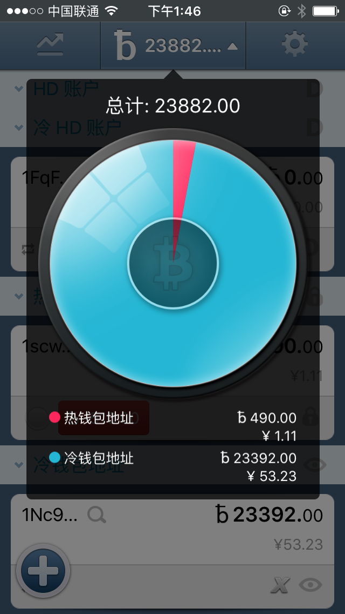)

第三个按钮：下面就是一些使用的小功能啦，默认的单位在BTC和bits之间的切换，默认货币的选择，交易所，手续费，头像设置等一系列狂拽酷炫叼炸天的功能，一键检查私钥功能也是安全性极大提高呢！

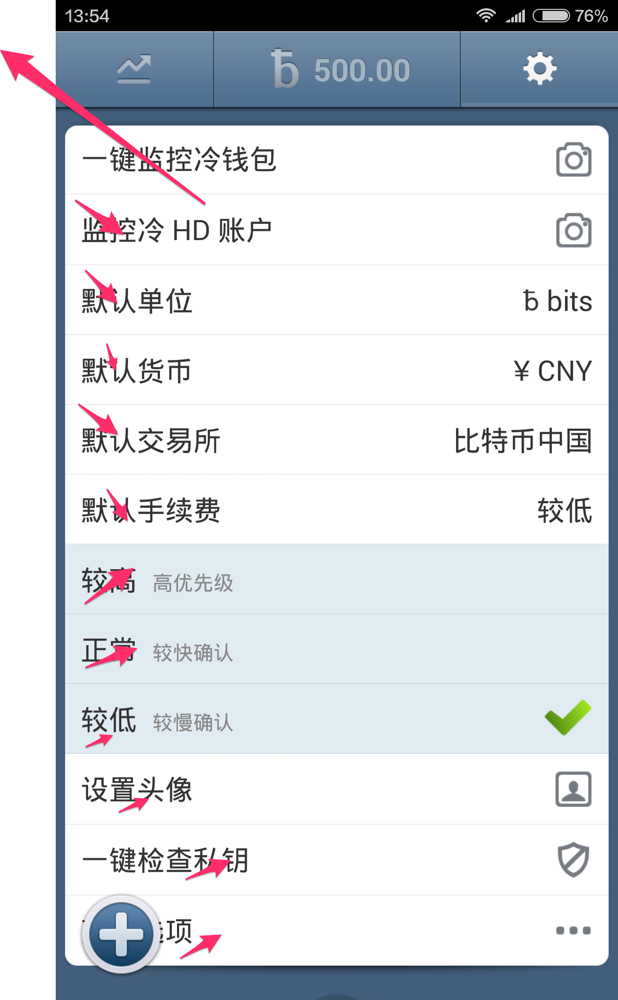

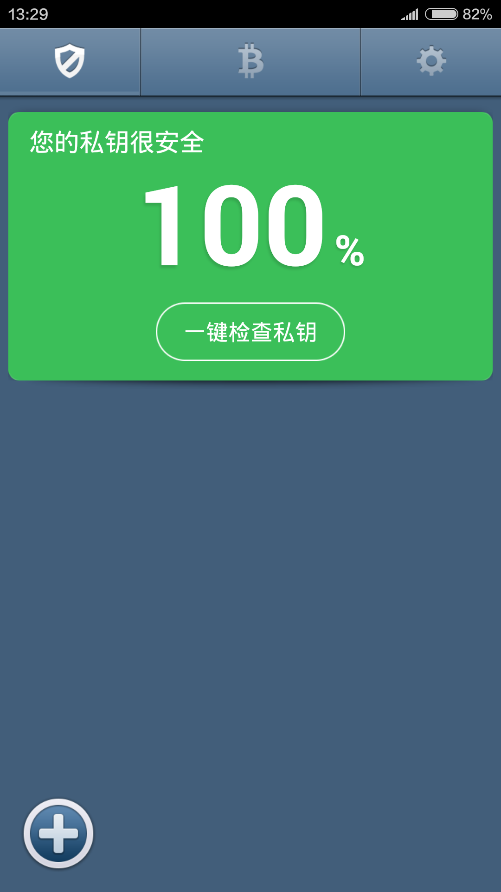

#####二:交易
对于小太大家也明白了一个基本架构和功能列表，那我们怎么样进行交易呢？

*他人支付给我的比特币:*

可以通过我的二维码或者地址序列号来向我交易比特币。

注：可以通过交易金额旁边的指示器了解到交易是否已被确认。

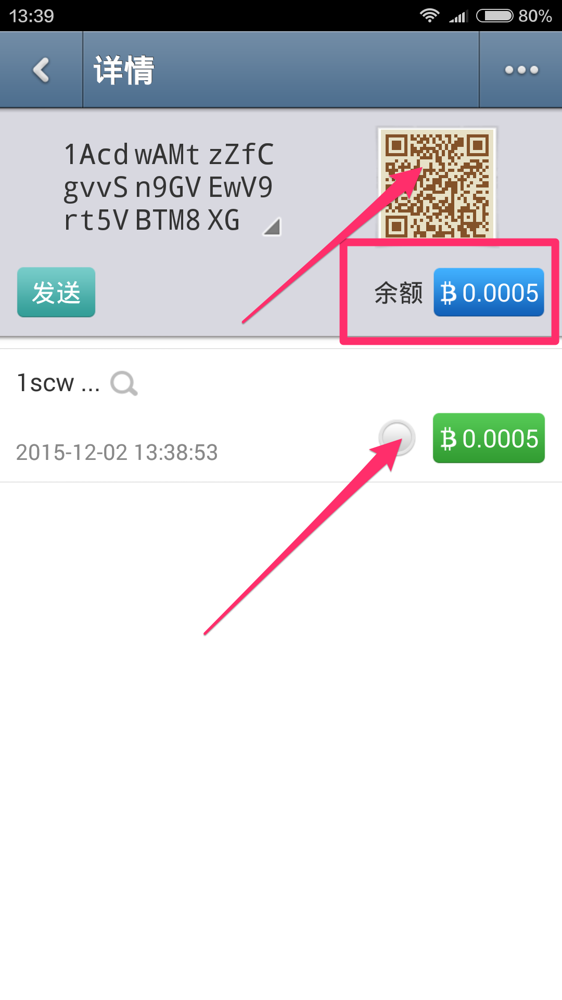

*我支付给他人比特币:*

同样的原理我也可以向他人交易我的比特币。

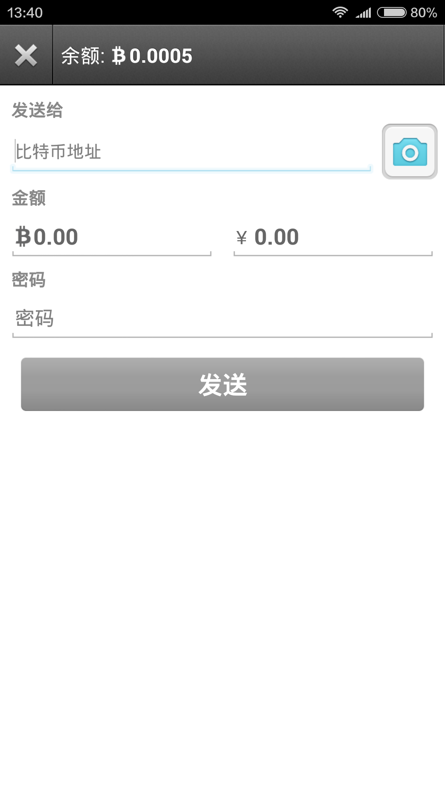

#####三:冷钱包
冷钱包的离线可以储存大额的比特币冷钱包装在闲置的手机上（必须断网），用于冷储私钥和离线交易签名，热钱包在联网手机上用于收发交易，冷热钱包通过二维码传递签名信息，既方便，又安全。

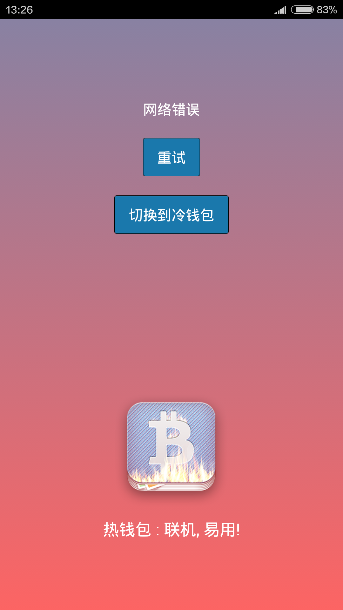

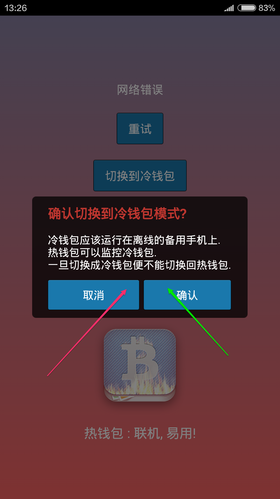

如热钱包一样，冷钱包可生成HD账户和私钥，热钱包是可以一键监控冷钱包的，也就是说，我可以通过热钱包交易冷钱包的比特币，但需要冷钱包的签名验证，然后热钱包得到冷钱包授权允许后，即可交易冷钱包的比特币。

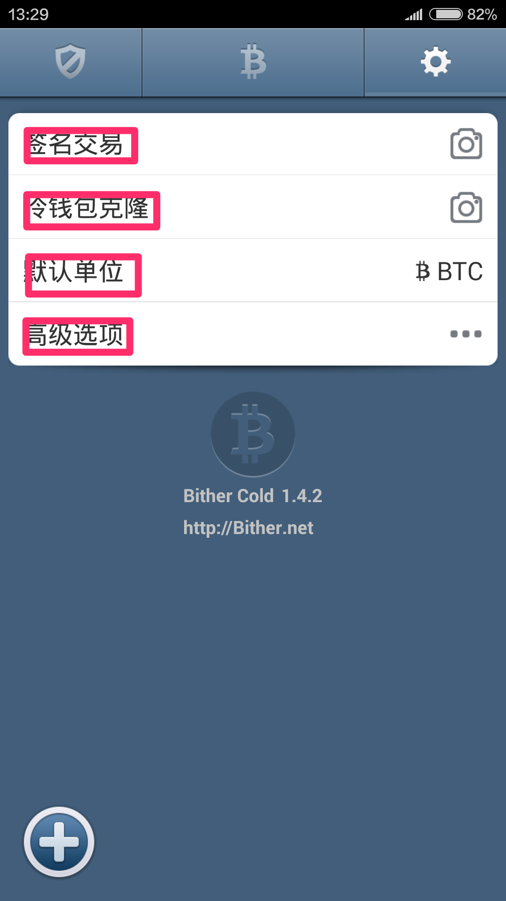
####比太钱包的技术支持：
比太钱包独有冷热钱包模式，让普通用户只需手机就能使用，就能既安全，又易用同时，比太钱包首创“极随机”XRandom，利用了智能手机上的多种感应设备，采集环境噪声，帮用户轻松获取“真”随机数。比太模式的冷热、极随机这些技术，国内外的钱包都没有，另外，比太钱包支持全平台，智能手机支持ios和安卓桌面版是java的，因此支持windows，macos，Linux。

######什么是极随机Xrandom？
我们当然希望私钥这个随机数足够“随机”，也就是尽可能的“真”随机。随机性不够，熵不够，就容易被人“碰”上，那种私钥，我们可以称其为不好的私钥。举个具体的例子，比如说，“1”这个数字，你就可以用它来当比特币私钥，只不过这个私钥很不好。因为任何人随手一试，都没准会尝试一下这个“1”，私钥就是一个随机数，并不是说比特币的私钥是不是好的随机数，或者是差的随机数，而是说，你给它的随机数是“好”的，它就好，你给它的随机数是“差”的，它就差。大部分比特币钱包解决方案（bitcoin-core/qt及其它），都依赖者一些随机数解决方案来提供密码学安全的随机数。不过这类随机数，在密码学里都称之为“伪随机数”，也就是用种子+算法来生成的。上述内容可能还是偏技术了一些，大体上说，比太在随机数方面应该还是领先于国内外竞争对手的。
######什么是冷热钱包模式?

冷热钱包指的是，用户在日常手机上运行比太热钱包。生成热钱包私钥，存放小额比特币，满足日常支付需求。用户还可以准备备用手机淘汰下来的旧手机，或者新购买的廉价安卓，100多块钱的都行。离线断网，运行比太冷钱包。生成一定数量的冷钱包地址，存放大额比特币。生成一定数量的冷钱包地址，存放大额比特币。因为离线断网，不用担心黑客。而且手机的用户体验很好，大家可以很方便的进行日常操作。热钱包可以监控冷钱包。也就是说，日常手机：小额、热钱包，监控冷钱包。备用手机：大额、离线。

比太致力于成为服务于所有比特币爱好者们一种安全可靠的产品，我们也会不断进步，谢谢大家的支持哦 ~ 

这里是我们的新浪微博，大家多多关注哈 ~~~
 [@比太钱包] (<http://weibo.com/bither>) 以及twitter[@bithernet](https://twitter.com/bithernet)
 
欢迎加入我们比太钱包官方QQ群 : 219098359  群内有我们的热心开发者等待你的加入!

